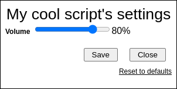

## Range type for GM_config

This library provides the a "range" type (like
[the `<range>` element][mdn-range]; a slider representing a numeric value)
suitable for use with [GM_config][gm-config] as a custom type. The result will
look something like the following:



The range type is exposed as a global named `GM_config_range_type`. It supports
all standard field settings, plus a few of its own (see the
[Settings](#settings) section below) and includes a text representation of the
slider's current value (which can optionally be labeled or formatted).

### Usage

There are two steps to using this type: adding a `@require` line to your
script's metadata block, and specifying it as a custom type when initializing
GM_config.

Example:

```javascript
// ==UserScript==
// @name      My Cool Script
// @namespace https://example.com/
// @match     https://*.example.com/*
// @require   https://benblank.github.io/user-scripts/libraries/gm-config-range-type.lib.js
// @grant     GM_getValue
// @grant     GM_registerMenuCommand
// @grant     GM_setValue
// ==/UserScript==

// Add the "@require" line above to your own script.

GM_registerMenuCommand('Configure my cool script', () => GM_config.open());

GM_config.init({
  id: 'myCoolScript',
  title: "My cool script's settings",

  fields: {
    volume: {
      label: 'Volume',
      type: 'range',
      default: 80,
      min: 0,
      max: 100,
      step: 10,
      unitLabels: '%',
    },
  },

  types: {
    // Point the "range" type to the global "GM_config_range_type".
    range: GM_config_range_type,
  },
});
```

The resulting fields can be styled via CSS in the same manner as any other
GM_config field.

### Settings

The range type supports the following settings in addition to those common to
all types:

- `min`, `max`, and `step`

  These have the same meaning as for [the `<range>` element][mdn-range] and are
  passed directly to it as attributes.

  The `list` attribute is not currently supported by this custom type, due to
  limited browser support.

- `unitLabels`

  In addition to the range slider itself, the range type also adds text
  indicating its current value. The `unitLabels` setting allows you to customize
  this text by labelling it with the units your field represents. There are
  three ways of using it:

  - falsy (e.g. unspecified, `false`, the empty string, etc.)

    No unit label will be applied at all; only the bare, numeric value will be
    shown.

  - a string

    If `unitLabels` is a single string, it will be directly appended to the
    current value (without a space). This is handy for e.g. percentages, where
    you can simply set it to `"%"`.

  - an array of two strings

    If `unitLabels` is an array of two strings, the first will be used when the
    value is exactly one, and the second will be used for all other values. This
    is handy for standard units. For example, if your field represents a number
    of seconds, you can set it to `[' second', ' seconds']` (note the space at
    the beginning of each string).

- `formatter`

  A more flexible alternative to `unitLabels`. If provided, this function will
  be called with the field's current value and settings when adding the current
  value text. Whatever it returns will be displayed as the current value. This
  could be used, for example, to store a value between 0 and 1, but display it
  as a percentage.

  Note that the `unitLabels` setting is a feature of the default formatter and
  will be ignored if you provide a custom formatter (unless you use it
  yourself).

  Example:

  ```js
  GM_config.init({
    id: 'myCoolScript',
    title: "My cool script's settings",

    fields: {
      volume: {
        label: 'Volume',
        type: 'range',
        default: 0.8,
        min: 0,
        max: 1,
        step: 0.01,

        formatter(value, settings) {
          return `${Math.round(value * 100)}%`;
        },
      },
    },

    types: {
      range: GM_config_range_type,
    },
  });
  ```

[gm-config]: https://github.com/sizzlemctwizzle/GM_config
[mdn-range]: https://developer.mozilla.org/en-US/docs/Web/HTML/Element/input/range
